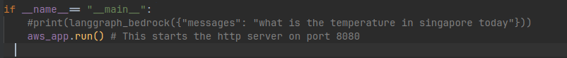
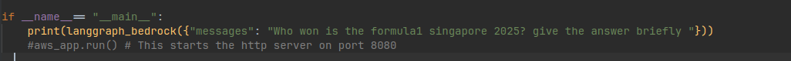
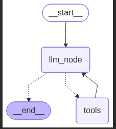
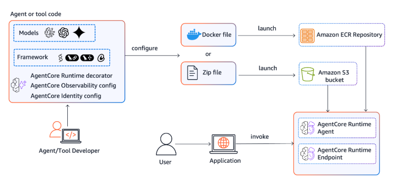

# ⚡ Plug & Productionize Your AI Agents with **AWS Bedrock AgentCore**

This repository demonstrates a streamlined approach to deploying locally developed AI agents using AWS Bedrock AgentCore.

I built a simple single-node LLM agent using an OpenAI model.  
Since LLMs are limited to their training data, I extended the agent with **DuckDuckGoSearchResults** (LangChain tool) to fetch current information from internet.

With just a few additional steps, we connect the agent to **AWS Bedrock AgentCore** — unlocking automatic scaling, serverless execution, and a fully managed runtime.

---

## 🧰 Tech Stack

| Component | Description |
|----------|-------------|
| **OpenAI** | Model: `gpt-5-nano` |
| **Agent Framework** | LangGraph |
| **Deployment** | AWS Bedrock AgentCore |
| **Tooling** | DuckDuckGoSearchResults (LangChain) |

---

## 📁 Project Structure

```bash
langgraph-openai-agentcore-demo/
├── README.md
├── agentcore-deployment/
│   ├── agent.py
│   └── requirements.txt
└── secret-policy.json
```

⚙️ Local Setup & Testing

Follow these steps to run the agent locally:

1. Create the virtual environment using conda

```bash
conda create -n agentcore python=3.10
```

2. Install the requirements file 

```bash
pip install -r requirements.txt
```

3. Store your OpenAI API key in AWS Secrets Manager


   As the OpenAI model requires an API key at runtime, the recommended best practice is to store the key securely in AWS Secrets Manager. During runtime, we can use a boto3 client to fetch the secret.

   Steps to store your API key in AWS Secrets Manager:

   - Go to AWS Console → Secrets Manager → Store a new secret

   - Select Other type of secret

   - Enter the key name as ```api-key``` and provide your API key value

   - Click Next

   - Name your secret ```my-api-key```

   - Click Next, then Store
  

4. Test the agent locally 

To test the code locally by python command with a prompt input.

   - Change directory to agencore-deployment & edit the file ```agent.py``` 
```bash
cd agentcore-deployment       
``` 
   - Uncomment the print statement line as below and comment the ```aws_app.run()``` line 

   - Input your desired query in the print statement to see the output, keep the messages key as it is and only update the value
        e.g. ```print(langgraph_bedrock({"messages": "Who won the formula1 race in singapore 2025? give the answer briefly"}))```

   Before:
   

   After:
   

   - Execute the code now and see the response
```bash  
python agent.py 
```

🧩 Architecture Overview

When a query is passed to the LLM, it first checks whether it already has the information needed to answer. If not, it triggers a tool call to the DuckDuckGoSearchResults web search tool to retrieve the required data. The agent may loop through this process, calling the web search tool multiple times until it gathers enough information. Once satisfied, the LLM generates the final response.



🚀 Deploying to AWS Bedrock AgentCore

Amazon Bedrock AgentCore is a modular suite of services designed to streamline the development and deployment of AI agents.
With Amazon Bedrock AgentCore, developers can accelerate AI agents into production with the scale, reliability, and security, critical to real-world deployment.

We will explore 2 services of Agentcore

1. Amazon Bedrock AgentCore Runtime

It provides a severless environment to run your agent code. This runtime can support any framework like langchain,crewai etc and supports any llm platform.The Amazon Bedrock AgentCore Runtime handles scaling, session management, security isolation, and infrastructure management, allowing you to focus on building intelligent agent experiences rather than operational complexity.

We will be using  AgentCore Starter toolkit to deploy the agents

AgentCore toolkit automatically packages your code into a Docker image, pushes it to an Amazon ECR (Elastic Container Registry) repository, and deploys it to a Serverless Runtime Environment. This environment automatically scales your agent up or down based on demand. Each deployed agent includes an endpoint that allows it to be invoked by consumers.



AgentCore Runtime allows you to host your agent with a very simple approach, with minimum requirements added to your agent code in the ```agent.py``` file.

- step1: Add the following to the ```requirements.txt``` file
```bash
bedrock-agentcore<=0.1.5
bedrock-agentcore-starter-toolkit==0.1.14
```
 - step 2: Import the neccessary library for agentcore
```bash
from bedrock_agentcore.runtime import BedrockAgentCoreApp 
```
 - step 3: Initalize the BedrockAgentCoreApp class
 ```bash
 aws_app = BedrockAgentCoreApp()
 ```
 - step 4: Add the entrypoint decorator
 ```bash
 @aws_app.entrypoint
 ```
 - step 5: Uncomment the last line
   Since we previously commented out aws_app.run() for local testing, we now uncomment it to enable invocation via the Bedrock runtime, and comment out the print statement.
 ```bash
    #print(langgraph_bedrock({"messages": "Who won the formula1 singapore 2025? give the answer briefly "}))
    aws_app.run() # This starts the http server on port 8080
 ```

Now we will execute the Agentcore starter toolkit cli to 

- Run the configure command to define the entrypoint file ie ```agent.py```

```bash
agentcore configure --entrypoint agent.py
```

- After execting the command you could see a ```Dockerfile``` and ```.yaml ``` created. The yaml file has the deployment details of the agent and dockefile basically has the instrcutions to deploy the agent in container.

Finally run the launch command to deploy 

```bash
agentcore launch
```

- Select all the defaults and hit enter like creating IAM role, IAM permission etc


- We have to provide the Bedrock agentcore IAM role created in the previous step with the permission to access secrets manager.
  Go to IAM role console and select add inline policiy and add the contents in the ```secret-policy.json``` and attach a policy to it/

- Invoke the deployed agent, now we could see response from the agent from the agentcore

```bash
agentcore invoke '{"message": "Hello"}'
```